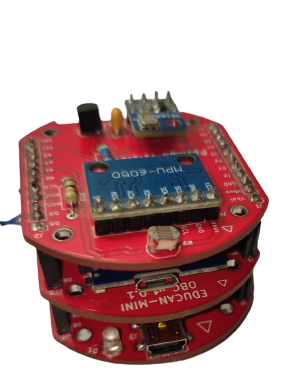
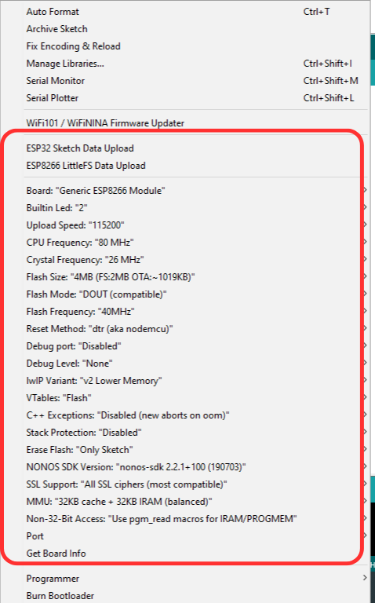
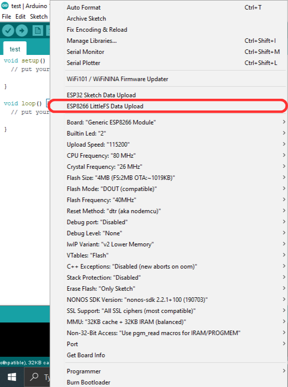

# EDUCAN-Mini-Software-Public

It consists of the software for EDUCAN-Mini;` a CanSat training Kit `that is used to gain Hands-on Experience on building and operating CanSat. A CanSat is a simulation of a real satellite, integrated within the volume and shape of a soft drink can. It is a type of Sounding Rocket Payload used to teach space technology. It is based on similar technology used in Miniaturized Satellites. The challenge is to fit all the major subsystems found in a satellite, such as power, sensors, and a communication system, into this minimal volume somewhere between 300-350gm. The CanSat is then launched to an altitude of a few hundred meters by a rocket or dropped from a platform or captive balloon, and its mission begins: to carry out a scientific experiment and achieve a safe landing. CanSat offers a unique opportunity to have the first practical experience of a real space project. They are responsible for all aspects: designing the CanSat, selecting its mission, integrating the components, testing, preparing for launch and then analyzing the data. CanSat is for everyone interested in electronics and Space Technology.

Our CanSat consists of a payload, ESP8266 board as the On Board Computer as well as Communication and a charging unit for the battery installed within the CanSat. The web-Server will be used as the Ground-station displaying data, eliminating the complexities of ground station design and hardware.

*Fig: Educan-Mini with subsystem*

## IDE Setup

### Setup of Arduino IDE for ESP8266/WEMOS (ESP12S)

1. Download the Arduino IDE from [click here](https://www.arduino.cc/en/software). Here, for example, the procedure assumes version 1.8.19 is downloaded.
2. To include the WEMOS/ESP8266 board, go to ` File -> Preference `. The preference setting will open up, and you will see the Additional Board Manager URL option. Go there and paste `https://arduino.esp8266.com/stable/package_esp8266com_index.json`. This will download the board required for ESP8266. Ensure you will get the following in the tools section and make sure to have the same configuration before uploading code.

   

3. Upload the blink code which you will now get for ESP 8266 in the Examples. ` File -> Examples -> ESP8266 -> Blink `. If the built-in led blinks as per the delay in code.

 ` Congratulations, you've successfully set the board for EDUCAN-MINI. `

## Setup for Little FS

1. For uploading the various file system that had been used for the extraction of sensor data, visualization of data in graphs, we have to use HTML, CSS, and JavaScript. For this to integrate within the Arduino as C++ format is nearly impossible and very difficult to debug. Thus the LittleFS is being used. For more understanding about the file system and Little FS along with SPIFFS, you can always visit the site [Read more](https://arduino-esp8266.readthedocs.io/en/latest/filesystem.html). For now, we will be concerning on the setup of Little FS for our example code.

   1. Download the 2.6.0 or later version of the tool from [click here](https://github.com/earlephilhower/arduino-esp8266littlefs-plugin/releases)
   2. In your Arduino sketchbook directory, create the tools directory if it doesn’t exist yet. (You can know your sketchbook directory by pressing `CTRL+k`).
   3. Unpack the tool into tools directory (the path will look like ` <home_dir>/Arduino/tools/ESP8266FS/tool/esp8266fs.jar `). If you are upgrading, overwrite the existing JAR file with the newer version.
   4. Restart Arduino IDE.

2. Now here comes the most critical part. Here you should know that for uploading various file system via Little FS, the procedure wants you to place all files inside a directory named ` data `.

   1. Open the example directory which has been provided to you. The directory is already in the format that Little FS requires. (If you want to create a new code, modify the chart type, or any other, format the file exactly the same.) There you can see inside the data directory, you have a basic HTML file, basic CSS file, and a highchart.js source file for graph visualization.
   2. For uploading the directory called data, after you successfully install LittleFS, you will see the following in your tools option.

   

   3. To upload a LittleFS filesystem use `Tools -> ESP8266 LittleFS Data Upload`. Make sure you have selected the correct port, board, and also any permission (if required).

## Setup for Arduino sketch file with the libraries and descriptions.

1. Now we can upload the `.ino` File that uses the filesystem for executing the tasks.

   1. In case of this, you have to add additional libraries for communication of the website to the controller, use of WiFi card, for the extraction of data from payloads.
   2. You can download library and add zip files or include from Arduino IDE via:
      * `Sketch -> Include library -> Add .zip library …`
      * `Sketch -> Include library -> Manage library…` to open the library manager.

### Libraries

1. For Payloads:
   * MPU6050: we have used the wire library.
   * BMP: Adafruit_BMP085 [click here](https://github.com/adafruit/Adafruit-BMP085-Library.git)
   * DallasTemperature for DS18B20 library [click here](dependencies/DS18B20-1.0.0.zip).

2. ESPAsyncTCP [click here](dependencies/ESPAsyncTCP-master.zip) and ESPAsyncWebServer [click here](dependencies/ESPAsyncWebServer.zip) have been used for communicating the ESP asynchronously with the web server.

3. Similarly, FS and LittleFS library are used for the use of LittleFS to open and execute the file previously uploaded as in the procedure mentioned in setup for LittleFS.

4. This is to clarify that any sensor can be deactivated or activated as per the modification of code. By default, the POCKETQUBE has 3 sensors as payload along with the EPS providing the battery data. The sensors MPU6050 and BMP are configured to use I2C protocol while DS18B20 is following the one-wire protocol.
5. If any sensor data is not meant to show, make sure to modify the function in the `.ino` file along with HTML and CSS file too.

6. EPS is capable of accepting the additional power supply to charge the battery. By default, it is using the USB mini port for charging the battery.

## Setup for Host website

1. Connect the host to the AP of the EDUCAN-MINI. The OBC is used as the Access Point (AP). Thus no internet is required, however, the receiving device (host: where the data is to be obtained) is required to have connected to the AP of OBC. This can be modified in the `.ino` file. Default ssid = "Dott" and password = "1234567890".
2. By default, the softAP command set the IP address to `192.168.4.1`. However, this can be set or changed. [Read more](https://arduino-esp8266.readthedocs.io/en/latest/esp8266wifi/soft-access-point-class.html)
3. The IP address is being published to the serial monitor.

**PS: during image upload via LittleFS, the serial monitor should not be opened.**
